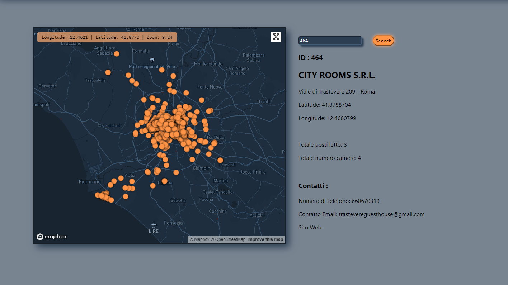

Progetto per le strutture ricettive. Elaborazione dei dati e ricerca.
---

**Mapbox GL JS**

Mappa interattiva con *Marker* per ogni struttura caricata sul sito di Roma Capitale.
Movimento e zoom libero, con possibilità di fullscreen e di prendere le coordinate attuali.
*Markers* dinamici su aggiornamenti delle liste.

**Ricerca struttura tramite ID**

Modulo di ricerca per le strutture tramite ID.
La ricerca offrirà dati filtrati:
* Via
* Coordinate
* Totale Posti Letto
* Totale Numero Camere
* Numero Di Telefono
* Contatto Email
* Sito Web

Lavori in corso
---

**Clusters**

Per migliorare l'efficienza della mappa interattiva, saranno create dei cluster con il numero di *Marker* da visualizzare
una volta effettuato lo zoom sulla zona.

**Modulo di ricerca alternativo**

Una nuova sezione in *Route* con un modulo di ricerca specifico, per via o coordinate.
Questo modulo darà informazioni più dettagliate delle strutture visualizzate.

**Aggiunta di una Sezione di Contatti o/e Aiuto**

**Miglioramento stile e CSS**

**Implementazione Database noSQL**

Per la raccolta dei dati di ricerca e tendenze.

Caratteristiche Tecniche:
---

**Sviluppo**

Quest'APP è sviluppata usando *Mongoose*, *MongoDB*, *Express()*, *React.js* and *Node.js*
Tutte le dependencies sono visualizzate nel *package.json*.

(***Bash Scripting***)

*npm start*

*cd backend && nodemon server*

Appearance:
---

**Apparenza dell'APP**

Conclusions:
---

Lavoro in corso
